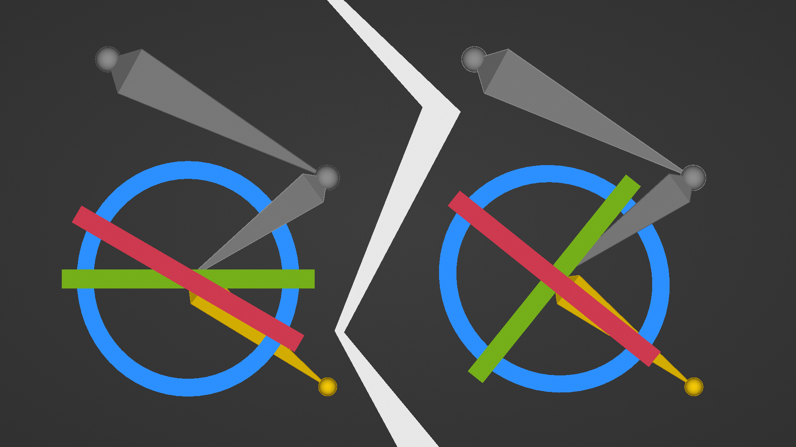
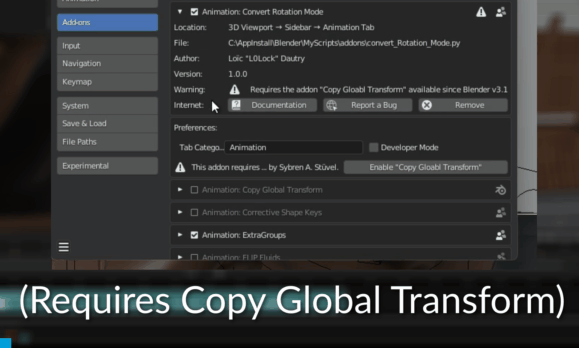
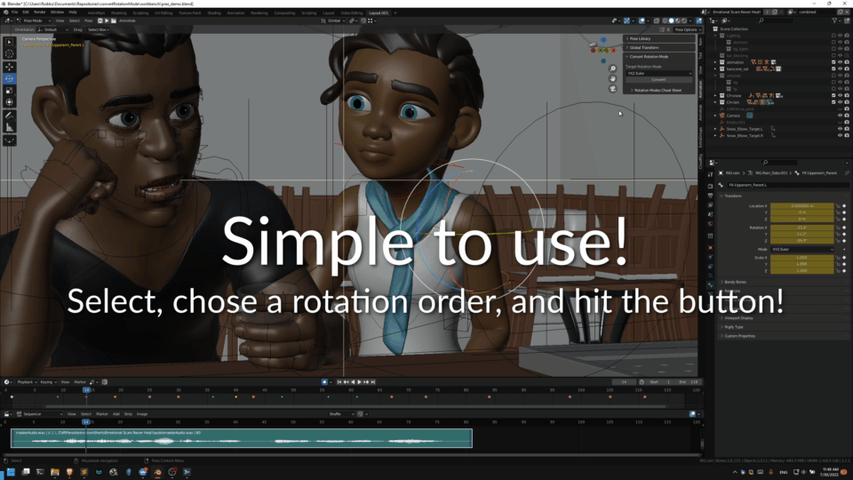
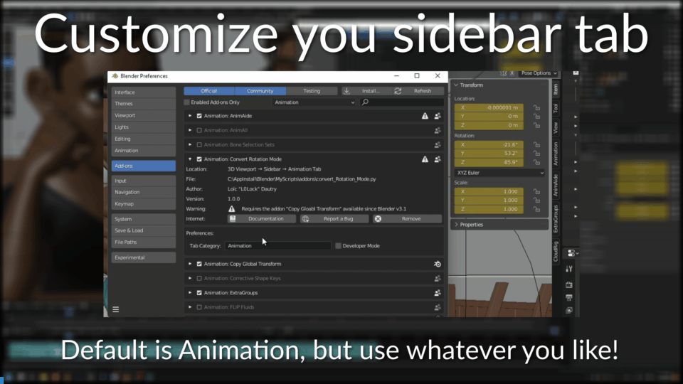
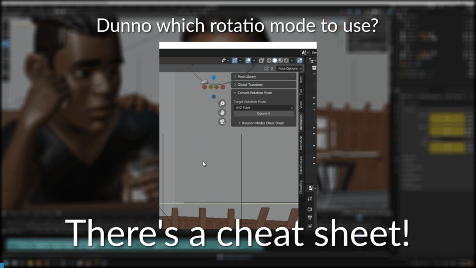

# Convert Rotation Mode

  

-----

*Convert Rotation Mode* (*CRM*) is an addon for Blender that allows you to change the rotation mode of the selected bones and preserve the animation or poses you already made.

## Installation

> [!CAUTION]
> **Requires [Copy Global Transform addon](https://wiki.blender.org/wiki/Reference/Release_Notes/3.1/Add-ons#Copy_Global_Transform), shipped with Blender since v3.1.0. and up**
> There's a handy button in the addon's preference to enable it if needed.

### Simple method:

- Go to Edit > Preferences > Get Extensions
- Search "Convert Rotation Mode"
- Hit the Install button

### Not so simple method:

- Download the [**latest release**](https://github.com/L0Lock/convertRotationMode/releases/latest).

- Go to Edit > Preferences > Get Extensions
- Hit the 🔽 button > Install from Disk
- Browse the zip file you downloaded.
  

## Usage:

Select one or more bones in Pose mode, select the rotation mode you want them to use, hit the <kbd>Convert!</kbd> button.

It will automatically scan through all the keyframes of the selected bones in the timeline.

To customize the sidebar tab in which the addon appears, go to the addon's preferences.

If you are unsure what rotation mode to use, look at the rotation modes cheat sheet!

Please not these are merely suggestions, what you will actually need may vary from one rig to another or even from one animation to another.

Note that there are two main coordinates system for bones. Blender uses Y down, so this is most likely the one you will use. But you might need to look at the X down in some cases like exporting to softwares that can only ready X down.

## Recommanded Rotation Modes:

### For Y down coordinates (Blender):

- COG: zxy

- Hip: zxy

- leg joints: yzx

- shoulder/clav: yxz

- upper arm: zyx (or yzx)

- lower arm: zyx (or yzx)

- wrist: yzx

- spine base: zxy

- mid spine: yzx

- chest: zxy

- neck: yxz

- head: yxz

### For X down coordinates

- COG: zxy

- Hip: zxy

- leg joints: xzy

- shoulder/clav: xyz

- upper arm: zxy

- lower arm: zxy

- wrist: xyz (or yzx?)

- fingers: yzx

- spine base: zxy

- mid spine: xzy

- chest: zxy

- neck: yxz

- head: yxz

